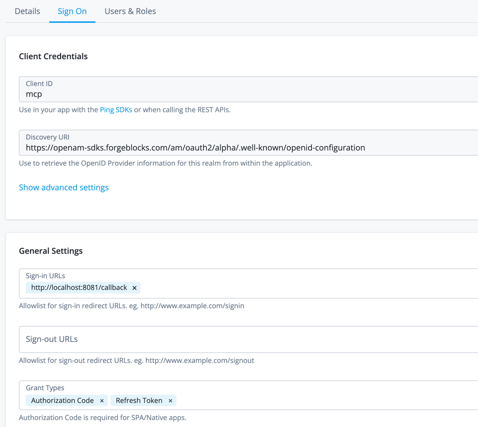

# dummy-mcp-server

A dummy MCP (Model Context Protocol) server built with Express and the MCP TypeScript SDK. It uses OAuth 2.0 bearer token authentication via Authorization Server and exposes a set of tools over HTTP.

## Tools

| Tool | Description |
|------|-------------|
| `calculateTax` | Calculates total price after applying a tax rate (default 15%) |
| `inspectAccessToken` | Returns details of the access token used for the current session |

## Prerequisites

- Node.js 18+
- An OAuth 2.0 authorization server (default: ForgeRock/PingAM)

## Installation

```bash
npm install
```

## Configuration

Set these environment variables before starting the server:

| Variable | Default | Description |
|----------|---------|-------------|
| `ISSUER` | `https://openam-sdks.forgeblocks.com:443/am/oauth2/alpha` | OAuth 2.0 issuer URL |
| `SERVER_URL` | `http://localhost:3000` | Public URL of this server |
| `PORT` | `3000` | Port to listen on |

Example `.env`:
```
ISSUER=https://your-forgerock-instance/am/oauth2/alpha
SERVER_URL=http://localhost:3000
PORT=3000
```

## Starting the Server

```bash
npm start
```

The server will be available at `http://localhost:3000/mcp`.

OAuth metadata is automatically advertised at:
- `/.well-known/oauth-authorization-server`
- `/.well-known/oauth-protected-resource/mcp`

## Configuring Claude Code

Add this server to your Claude Code MCP configuration. You will need a valid OAuth access token from the configured issuer.

### Project-level config (`.claude.json`)

```json
{
  "mcpServers": {
    "dummy-mcp-server": {
      "type": "http",
      "url": "http://localhost:3000/mcp",
      "oauth": {
        "clientId": "mcp",
        "callbackPort": 8081,
        "scopes": "openid address phone email"
      }
    }
  }
}
```

### OAuth Application Configuration


### config (`~/.claude.json`)

Use the same snippet above in your global settings file to make the server available across all projects.